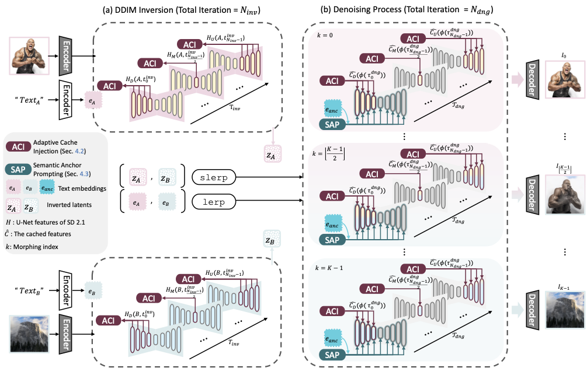

<h1>
  [arXiv'25]  
CHIMERA: Adaptive Cache Injection and Semantic Anchor Prompting for Zero-shot Image Morphing with Morphing-oriented Metrics
</h1>

**[Dahyeon Kye](https://cmlab.cau.ac.kr/)1\*, [Jeahun Sung](https://cmlab.cau.ac.kr/)1\*, [Minkyu Jeon](https://minkyujeon.github.io/)2, [Jihyong Oh](https://cmlab.cau.ac.kr/)1†**
 
 
1Chung-Ang University, 2Princeton University,
 
*Co-first authors (equal contribution), †Corresponding authors

<!-- * Official project page:  https://cmlab-korea.github.io/CHIMERA/
* Paper (arXiv):  -
* Code will be updated soon -->

This repository is the official PyTorch implementation of "CHIMERA: Adaptive Cache Injection and Semantic Anchor Prompting for Zero-shot Image Morphing with Morphing-oriented Metrics".

Figure 1. Qualitative result of smoothness of morphing transition (Smooth), heterogeneous-aware domain consistency (Domain Consistency), and perceptual quality (Perceptual Quality). Here, ✗ indicates cases that fail for most pairs, ▲ represents cases that fail for some pairs, and ✓ denotes cases that succeed for most pairs.

## 📧 News
* **Dec 9, 2025**: The paper is available on [arXiv](https://arxiv.org/pdf/2512.07155).
* **Dec 3, 2025**: This repository is created.

## 📝 Code Release Plan
- [ ] GLCS code upload
- [ ] main CHIMERA code upload
- [ ] Data preparation guidelines

## 🧠 Abstract
Diffusion models exhibit remarkable generative ability, yet achieving smooth and semantically consistent image morphing remains a challenge. Existing approaches often yield abrupt transitions or over-saturated appearances due to the lack of adaptive structural and semantic alignments. We propose CHIMERA, a zero-shot diffusion-based framework that formulates morphing as a cached inversion–guided denoising process. To handle large semantic and appearance disparities, we propose Adaptive Cache Injection and Semantic Anchor Prompting. Adaptive Cache Injection (ACI) caches down, mid, and up blocks’ features from both inputs during DDIM inversion and re-injects them adaptively during denoising in depth- and timestep-adaptive manners, enabling natural feature fusion and smooth transitions. Semantic Anchor Prompting (SAP) leverages a vision–language model to generate a shared anchor prompt that serves as a semantic anchor, bridging dissimilar inputs and guiding the denoising process toward coherent results. Finally, we introduce the Global-Local Consistency Score (GLCS), a morphing-oriented metric that simultaneously evaluates the global harmonization of the two inputs and the smoothness of the local morphing transition. Extensive experiments and user studies show that Chimera achieves smoother and more semantically aligned transitions than existing methods, establishing a new state-of-the-art in image morphing. The code and project page will be publicly released.

## Method Overview
CHIMERA: A zero-shot diffusion morphing framework based on cached inversion-guided denoising, achieving structurally semantic alignment in training-free manner.

1. **Adaptive Cache Injection (ACI)**: Adaptively re-injects cached inversion features in a depth- and timestepadaptive manner, stabilizing feature fusion and yielding smooth morphing transitions. 
2. **Semantic Anchor Prompting (SAP)**: Leverages a shared high-level anchor-prompt inferred from the two inputs, effectively bridging semantics between them and reducing drift for heterogeneous pairs. 
3. **Global-Local Consistency Score (GLCS)**: A new morphing-oriented metric that jointly quantifying the global harmonization and the smoothness of the local transition.
 
## 📁 Prepare Dataset
TBD;

## ⚙️ Environment Setting
TBD;

## 🚀 Get Started
TBD;

## ✨ Results
Please visit our [project page](https://cmlab-korea.github.io/CHIMERA/).
